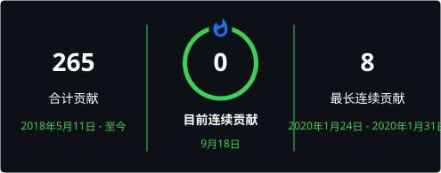
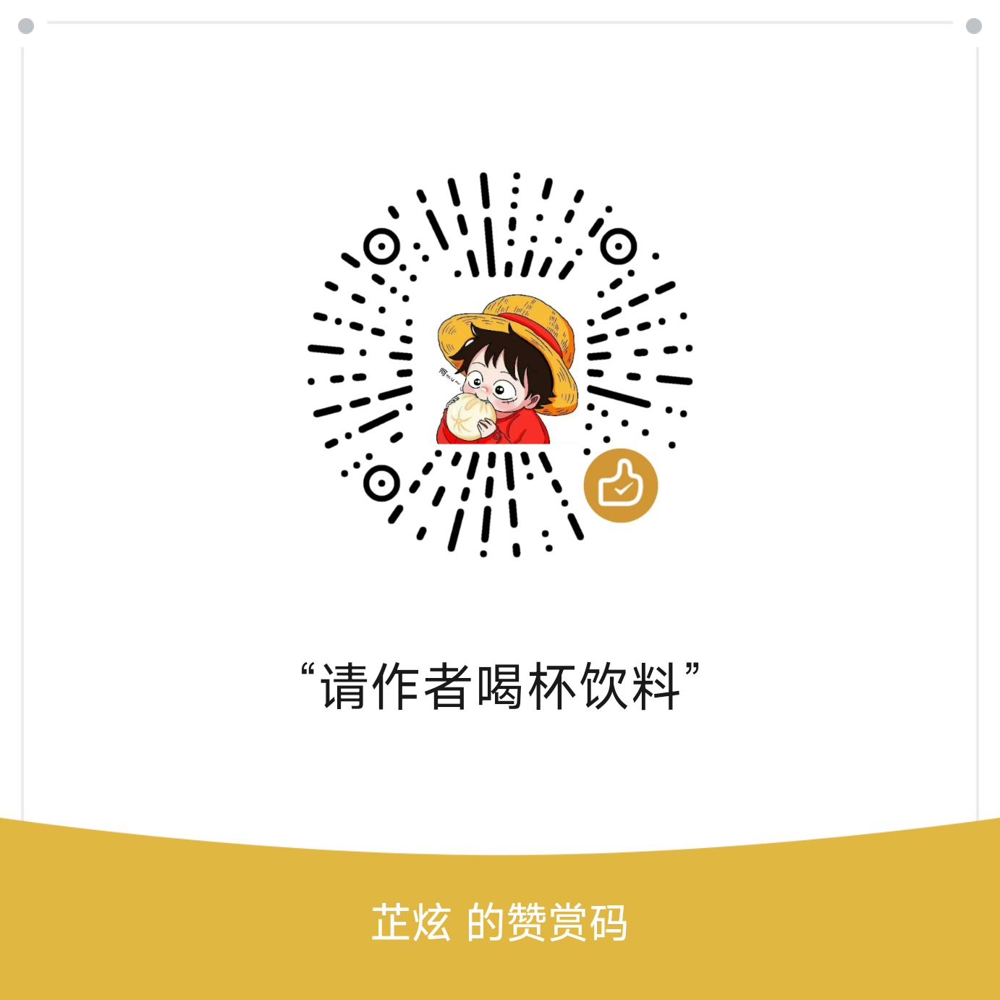

# 你好 👋 我是 芷炫

> 🚀 热爱打造实用开源工具的开发者。

---

## 🧑‍💻 关于我

- 🔭 目前正在做 **[QZoneExport](https://github.com/Licfe/QZoneExport)** —— 一个用于备份 QQ 空间数据（说说、日志、相册、留言板、视频等）的浏览器扩展。
- 🌱 正在学习 **WXT · Vue 3 · TypeScript** 以及浏览器扩展开发相关的各种知识。
- 👯 希望参与那些「让数据可携带、归用户所有」的开源项目。
- 💬 欢迎找我聊 **浏览器扩展、数据备份/导出、前端架构**。
- 📫 联系方式：**lvshuncai@gmail.com**
- 😄 代词：他/他
- ⚡ 趣闻：我坚信你的数据，理应能被你自己带走。

---

## 🛠️ 技术栈与工具

  
  
  
  
  
  
  
  
  

---

## 📊 GitHub 数据

<!-- 以下图片由 .github/workflows 下的 GitHub Actions 每日生成并提交到 profile/ 目录，不依赖任何外部服务器 -->

  

  

  

---

## 🏆 精选项目

| 项目 | 简介 |
| --- | --- |
| [QZoneExport](https://github.com/Licfe/QZoneExport) | 💾 用于备份 QQ 空间数据的浏览器扩展（WXT + Vue 3 + TS）。 |

---

## 🌐 联系我

  
  
  

---

## ☕ 赞助 / 赞赏

如果我的开源项目对你有帮助，欢迎请我喝杯咖啡 ☕

  
  
  

---

## 👀 访客统计

  

<!--
🔧 自定义小贴士：
1. 修改统计卡主题：github_dark 可换成 [dark, radical, tokyonight, merko, gruvbox, dracula, ...]
2. 想要浅色风格？把 github_dark 改为 default，github-dark 改为 github。
3. 用 ?hide= 隐藏不想显示的语言（例如 &hide=html,css）。
4. 这个特殊仓库的名称必须和你的 GitHub 用户名完全一致，否则不会显示在个人主页。
-->
